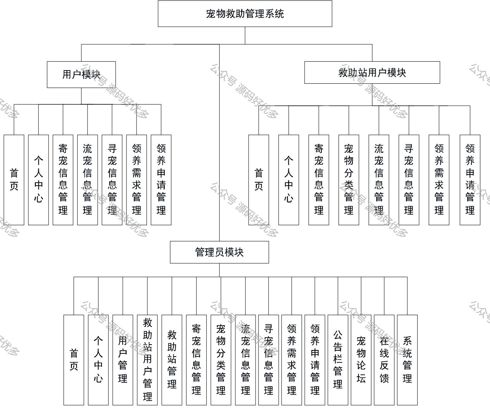
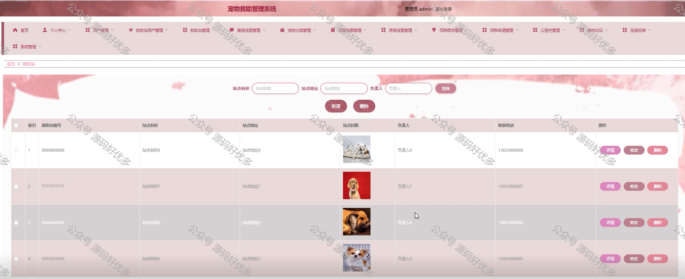

 
## 查看主页获取源码

> **作者介绍**： **✌**全网粉丝10W+本平台特邀作者、博客专家、CSDN新星计划导师、java领域优质创作者,博客之星、掘金/华为云/阿里云/InfoQ等平台优质作者、专注于项目实战 **✌**

  

### 一、作品包含

源码+数据库+设计文档万字+PPT+全套环境和工具资源+部署教程

### 二、项目技术

前端技术：Html、Css、Js、Vue、Element-ui

数据库：MySQL

后端技术：Java、Spring Boot、MyBatis

  

### 三、运行环境

开发工具：IDEA/eclipse

数据库：MySQL5.7

数据库管理工具：Navicat10以上版本

环境配置软件： JDK1.8+Maven3.6.3

前端Nodejs：14

  

### 四、项目介绍
项目编号：springbootA074

随着信息时代的来临，过去的传统管理方式缺点逐渐暴露，对过去的传统管理方式的缺点进行分析，采取计算机方式构建宠物救助管理系统。本文通过课题背景、课题目的及意义相关技术，提出了一种寄宠信息、流宠信息、寻宠信息、领养需求、领养申请等于一体的系统构建方案。
本文通过采用B/S架构，MVC开发模式、MySQL数据库以及java语言、springboot框架，结合国内线上管理现状，开发了一个基于springboot的宠物救助管理系统。系统分为多个功能模块：用户信息、救助站用户信息、寄宠信息、流宠信息、寻宠信息、领养需求等。通过系统测试，本系统实现了系统设计目标，相对于人工管理方式，本系统有效的减少了求助站的经济投入，并且大幅度提升了宠物救助管理的效率。

### 五、运行截图

  
